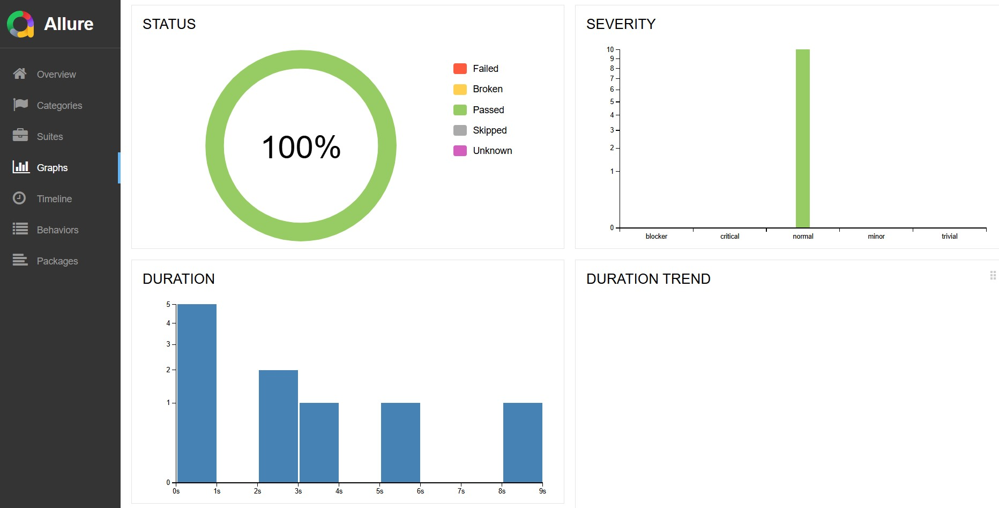
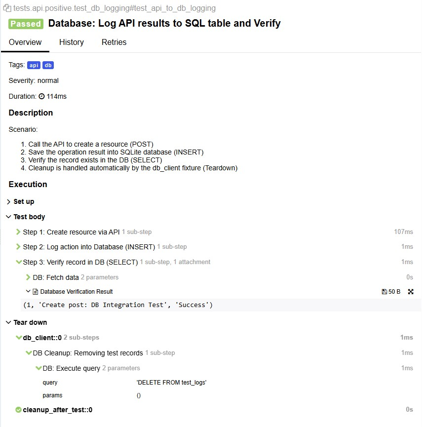

# Eco-Hybrid-Lab: Hybrid Test Automation Framework

### [💡 View the 📊 Interactive Architecture & Test Scenarios](https://mike-novozhenov.github.io/Eco-Hybrid-Lab/architecture.html)
> **Note:** This report provides a deep dive into the hybrid automation strategy, including performance metrics (API/DB < 200ms) and visual traceability of E2E flows


[](https://github.com/mike-novozhenov/Eco-Hybrid-Lab/actions/workflows/tests.yml)
[](https://mike-novozhenov.github.io/Eco-Hybrid-Lab/)
---

## Project Overview
This project demonstrates a hybrid approach to test automation, integrating UI, API, and Database layers into a single, scalable framework.

### 📊 Performance & Observability

*Summary: 100% Pass Rate | 10 Tests | **13.5s Total Duration***

The framework is engineered for high-speed feedback and resource efficiency:
* **Execution Speed:** 100% Pass Rate for 10 hybrid test cases in **13.5s** (UI + API + DB)
* **API/DB Layer (< 120ms):** Ultra-fast backend validation with integrated SQL auditing
* **Dockerized CI/CD (GitHub Actions):** * **Cold Start:** ~2m 10s (full image build)
    * **Cached Run:** **~45s - 1m** (leveraging `buildx` layer caching)
* **UI Resilience:** Headless execution and strategic resource blocking ensure stable flows in under **2s** per scenario

<details>
<summary>🔍 <b>Deep Traceability Example (Click to expand)</b></summary>
<br>

For the **API to DB Sync** scenario, the report captures every internal step with raw data evidence:

1. **POST Request:** Resource creation verified in **107ms**
2. **DB Logging:** Action recorded via SQLAlchemy in **1ms**
3. **Data Audit:** Direct SQL `SELECT` verifies persistence with raw data attachment: `(1, 'Create post...', 'Success')`
4. **Auto-Cleanup:** Environment is reset via `Tear down` fixtures automatically

<p align="center">
  
</p>

</details>

<details>
<summary><b> ⏱️ View Performance Benchmarks (Why this framework?)</b></summary>

### Speed vs. Strategy Comparison
This framework is designed to solve the "slow UI tests" bottleneck. Here is a comparison of execution times for the same 10 scenarios:

| Strategy                      | Execution Time | Key Difference |
|:------------------------------| :--- | :--- |
| ⬜ Traditional UI (Sequential) | ~45-60s | Browsers open/close one by one [cite: 2026-02-01] |
| ⬜ Pure API Tests              | ~2-3s | No UI overhead, but skips visual validation [cite: 2026-02-01] |
| ✅ **Eco-Hybrid (This Repo)**  | **7-8s** | **Parallel UI + Async API + Lightweight DB** [cite: 2026-02-01] |

> **Engineering Note:** We achieve this by offloading heavy data preparation to API/DB layers and running UI checks in parallel via `pytest-xdist`. This ensures maximum coverage with minimum wait time

</details><br>

> **Key Takeaway:** By utilizing a hybrid approach, 80% of the test suite provides feedback in under 4 seconds, significantly reducing CI/CD pipeline costs
---

### 🟢 Positive Scenarios (Happy Path)
| Scenario | Layer | Technical Highlights & Patterns | Validation & Data Handling | Risk Mitigated |
| :--- | :--- | :--- | :--- | :--- |
| **E2E Shopping Flow** | Hybrid | **POM**, Session persistence, API-driven preconditions | UI State + URL verification; Real-time session auth | Broken conversion funnel |
| **API Data Contract** | API | Type checking (ID as int), header validation | JSON Schema; Status 201; Header integrity | Integration mismatches |
| **API to DB Sync** | API + DB | **Singleton DB Client**, Automated SQL Teardown | Cross-layer integrity (SQL SELECT match) | Silent data loss in backend |
| **Add to Cart** | UI | Dynamic dialog handling, `wait_for_selector` logic | Cart persistence; Alert automation | UI/Logic synchronization |

### 🔴 Negative Scenarios (Resilience & Edge Cases)
| Scenario | Layer | Technical Highlights & Patterns | Validation & Data Handling | Risk Mitigated |
| :--- | :--- | :--- | :--- | :--- |
| **Empty Checkout** | UI | **Turbo Mode**: Asset blocking, 3.7s speed, `dispatch_event` | Alert Interception; No-wait actionability | UI validation bypass |
| **Broken Links Audit** | UI / API | **Multi-threading**: 11 parallel workers, HEAD requests | HTTP Status 200/300; Concurrent discovery | Negative SEO & Dead UX |
| **Auth Resilience** | UI | **Event-driven**: `expect_event("dialog")` (No `sleep`) | Regex alert text match; Dynamic waiting | Flaky tests / Async race conditions |
| **Malformed API Data**| API | Schema resilience, Type-mismatch payloads | JSON Contract; Documentation of server flaws | Backend crashes on bad input |
| **API Failure Logs** | API + DB | Integrated Error Logging (404 -> DB) | Status code mapping to SQL audit logs | Untraceable system errors |


### 🛠 Engineering DNA (Best Practices)
* **Zero-Sleep Policy:** No static timeouts. All asynchronous states are handled via Playwright's native event listeners and smart assertions
* **Extreme Performance:** Optimized execution through strategic resource blocking (CSS/Images) and multi-threaded processing
* **Deep Observability:** Automated Allure reporting with integrated screenshots, browser trace logs, and SQL query snapshots for every failure
* **Clean State Management:** Singleton-based database connectivity with automated transaction teardowns to ensure environment purity
* **Infrastructure as Code:** Fully containerized environment using Docker to eliminate "it works on my machine" issues and ensure 100% parity between Local and CI environments
* **Intelligent Layer Caching:** Optimized GitHub Actions pipeline that reduces build time by ~70% using persistent storage for Docker layers

## 🚀 Tech Stack
* **Language:** Python 3.13
* **Containerization:** Docker (Multi-stage builds)
* **CI/CD:** GitHub Actions (with Docker Layer Caching)
* **UI Engine:** Playwright (Chromium / Headless)
* **Test Runner:** Pytest
* **Database:** SQLAlchemy + SQLite3
* **Reporting:** Allure Reports (Automated GitHub Pages deployment)


## 📂 Project Structure
```text
├── data/               # Test data and DB initialization
├── pages/              # Page Object Models (UI layer)
├── tests/              # Test suites (UI, API, Integration)
├── utils/              # API clients, DB wrappers, Loggers
├── .env.example        # Environment variables template
├── pytest.ini          # Test runner configuration
└── requirements.txt    # Project dependencies
```

## 🚀 Quick Start & CI/CD

### Option A: Running with Docker (Recommended)
The fastest way to run the entire suite. Use this one-liner to build and run in one go:
```bash
docker build -t hybrid-framework . && docker run --rm -v "$(pwd)/allure-results:/app/allure-results" hybrid-framework
```
### Option B: Local Development

Setup, Install and Run:
```bash
python -m venv .venv && source .venv/bin/activate  # Windows: .venv\Scripts\activate
pip install -r requirements.txt && playwright install chromium
pytest --alluredir=allure-results
```
Once the tests finish, you can generate and open the Allure report:
```bash
allure serve allure-results
```

### ⚙️ CI/CD Infrastructure
The project includes a robust **GitHub Actions** pipeline ([`.github/workflows/tests.yml`](.github/workflows/tests.yml)):

* **Dockerized Execution:** Ensures 100% environment parity between local development and CI environments.
* **Intelligent Caching:** Utilizes `buildx` and `actions/cache` to store Docker layers, reducing build time by ~70% on subsequent runs.
* **Auto-Deployment:** Test results and Allure reports are automatically generated and published to **GitHub Pages** after every push to the `main` branch.